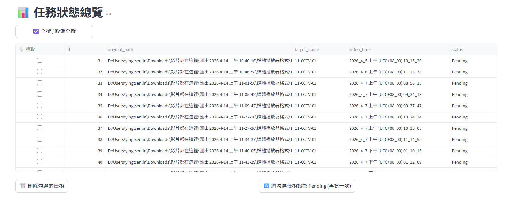
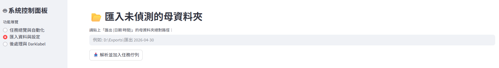
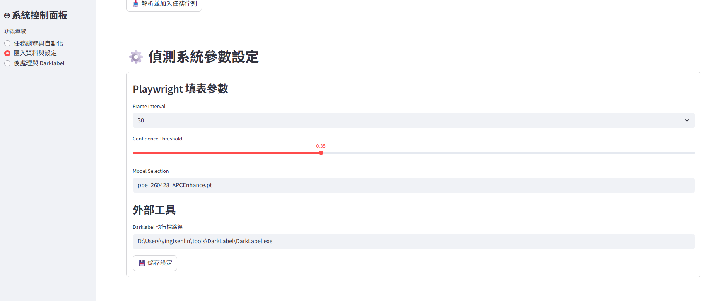
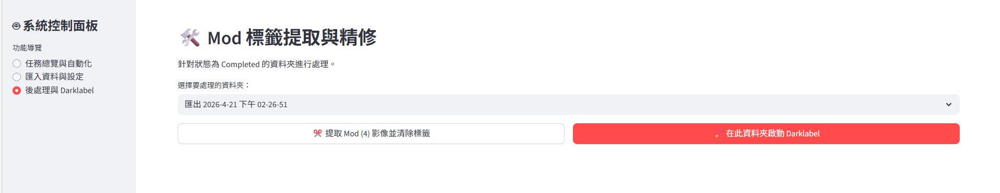

# Extract MOD Frames (之後會改名)

這個專案是用來串接「影片偵測自動化 + 後處理精修」的工具，核心目標是：
- 批次匯入影片任務
- 透過 Playwright 自動操作網頁偵測
- 下載 YOLO 資料集到 `output/`
- 提取含 `mod(4)` 的影像，並在輸出時自動移除 `mod` 標籤
- 一鍵啟動 DarkLabel 進行精修

## 功能

- 任務管理（SQLite）
  - 任務新增、刪除、重試（Pending）
  
  - 匯入任務
    


- 偵測自動化（Playwright）
  - 自動載入模型、信心值、上傳影片、下載結果
  
- 後處理
  - `✂️ 提取 Mod (4) 影像並清除標籤`
  - 僅提取「曾出現 mod(4)」的幀
  - 在提取出的標註檔中，自動移除所有 `4 ` 開頭標註列
  
- DarkLabel 整合
  - 啟動前自動更新 `darklabel.yml` 的預設路徑
  - 自動設定：`media_path_root`、`gt_path_root`、`auto_gt_load=1`、`gt_file_ext="txt"`
  - 按下 `在此資料夾啟動 Darklabel`後， Darklabel會自動開啟，*open images 後會自動進入目標路徑*
  - 目標路徑以英文與數字為主

## 專案結構

```text
source/
├── app.py
├── config.yaml
├── requirements.txt
├── database/
│   └── tracker.db
├── modules/
│   ├── db_manager.py
│   ├── file_parser.py
│   ├── playwright_bot.py
│   └── post_process.py
└── output/
```

## 安裝與啟動

1. 安裝套件

```bash
pip install -r source/requirements.txt
```

2. 啟動介面（在 `source/` 目錄）

```bash
streamlit run app.py
```

## 設定檔

*使用前請先更新設定檔*

`source/config.yaml`：
- `detection_params.confidence`：偵測信心值
- `detection_params.frame_interval`：抽幀間隔
- `detection_params.model`：模型名稱
- `tools.darklabel_path`：DarkLabel 執行檔完整路徑（例如 `D:\Users\...\DarkLabel.exe`）

## 使用流程

1. 在「匯入資料與設定」輸入母資料夾並建立任務
2. 到「任務總覽與自動化」啟動機器人
3. 完成後到「後處理與 Darklabel」
4. 按 `✂️ 提取 Mod (4) 影像並清除標籤`
   - 輸出資料夾：`<原資料夾>_mod_extracted`
   - 內容包含：
     - `images/`：有出現 mod 的影像
     - `labels/`：已移除 mod(4) 標籤列的標註
5. 視需要按 `🖌️ 在此資料夾啟動 Darklabel` 進行人工精修

## 注意事項

- `tracker.db` 位於 `source/database/tracker.db`
- 若 DarkLabel 無法啟動，先確認 `config.yaml` 的 `darklabel_path` 是否正確
- 啟動自動化前，請確認目標網站可連線且帳號權限正常
